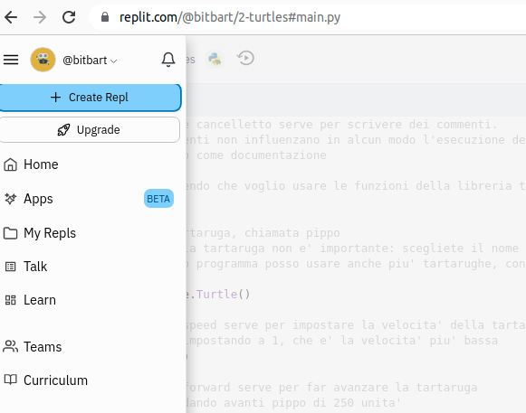
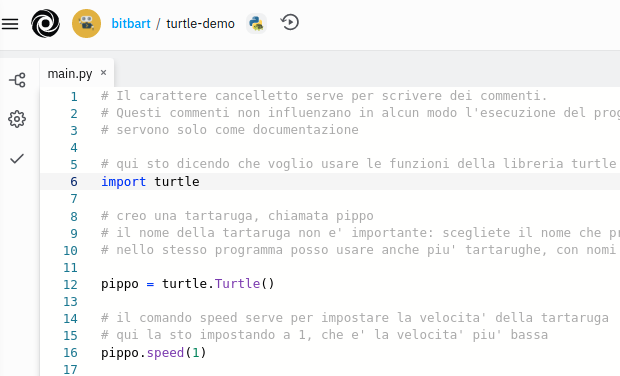
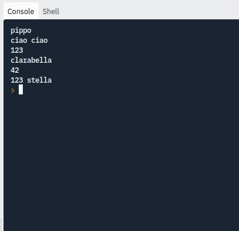

# Output su console

Il programma nel file [main.py](main.py) introduce il comando **print**, che stampa un messaggio sulla console

1. Studia con attenzione il programma, seguendo i commenti che precedono ogni comando;
2. Crea un nuovo repl su [repl.it](https://replit.com/); 

3. Si aprirà una finestra per scegliere il template: scegli "Python"; 

4. Copia il programma dal file [main.py](main.py) alla finestra di testo su repl.it;

5. Prova a eseguire il programma, cliccando sul tasto "Run" verde in alto. 
6. L'output del programma apparirà sulla **console**, ovvero la finestra nera a fianco di quella con il programma:

7. Per capire meglio l'effetto di ogni comando, prova ad aggiungere alcune linee di codice al programma, o a modificarne qualche linea, 
   e poi prova ad eseguirlo di nuovo per vedere se l'effetto è quello atteso;
   
8. Se ci sono errori nel programma, verranno scritti dei messaggi sulla console; 
9. Gli errori fanno terminare il programma prematuramente: correggi il programma e assicurati che non ci siano più messaggi di errore in console.
