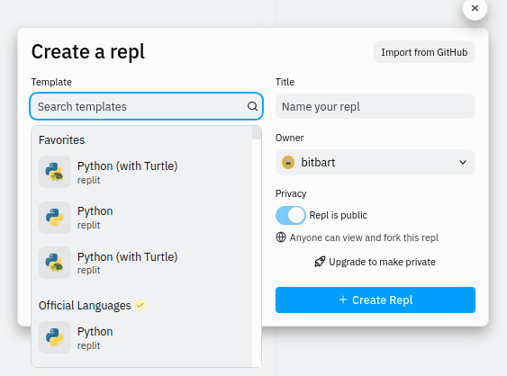
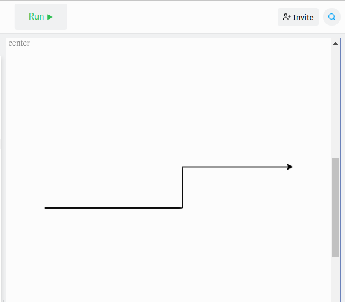

# Teoria: disegna con la tartaruga

Il file [main.py](main.py) in questa cartella è un programma Python. Il programma introduce alcuni comandi della libreria Turtle, che permettono di disegnare sullo schermo facendo muovere una tartaruga.

1. Studia con attenzione il programma, seguendo i commenti che precedono ogni comando;
2. Crea un nuovo repl su [repl.it](https://replit.com/); 

3. Si aprirà una finestra per scegliere il template: scegli "Python (with Turtle)"; 

4. Copia il programma nella finestra di testo;

5. Prova a eseguire il programma, cliccando sul tasto "Run";

6. Per capire meglio l'effetto di ogni comando, prova ad aggiungere alcune linee di codice al programma, o a modificarne qualche linea, 
   e poi prova ad eseguirlo di nuovo per vedere se l'effetto è quello atteso;
7. Se ci sono errori nel programma, verranno scritti dei messaggi nella finestra nera ("Console"); 
8. Gli errori fanno terminare il programma prematuramente: correggi il programma e assicurati che non ci siano più messaggi di errore in console;
9. Questo è tutto quello che ti serve sapere per svolgere i compiti dell'esercitazione 1!
